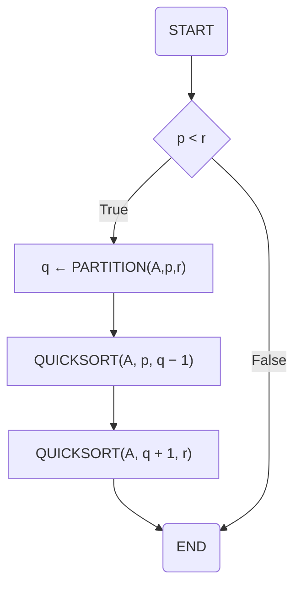
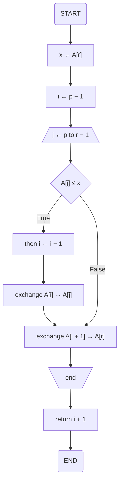
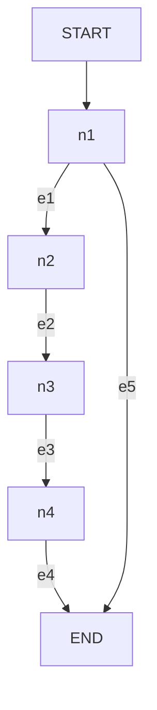
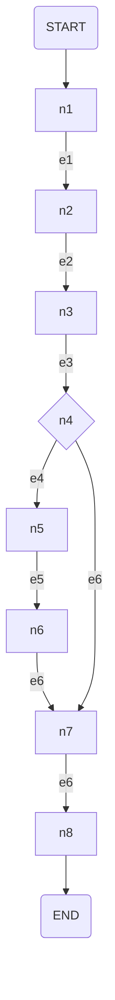

# unit6

- Fundamentals of Measurement Theory
- Measuring Module Cohesion
- Coupling
- Cyclomatic Complexity
- Psychological Complexity
- Effort Estimation

## Goal

- By the end of this Unit, you will be able to:
  - Learn fundamentals of measurement theory
  - Estimate development time and budget
  - Measure cyclomatic complexity of the project
  - Understand software quality issues

## Task

- [x] Reading assignment
- [x] PeerAssessment
- [x] Discussion Forum
  - [x] first post
  - [x] reply classmates
- [x] Programming assignmet
- [ ] Learning Journal
- [x] Take Self-Quiz

## Reading Assignment

- Marsic, I. (2012). Software engineering. Rutgers Unversity. <https://www.ece.rutgers.edu/~marsic/books/SE/book-SE_marsic.pdf>
  - 4.1 Fundamentals of Measurement Theory
    - ソフトウェアの特性を計測することは、プロジェクトの工数を見積もることを期待して実施している
    - ソフトウェアの特性として一般的に計測されるものは、「サイズ」と「複雑性」だ
    - 4.1.1 Measurement Theory
      - 測定理論では、nominal, ordinal, interval, ratio, and absoluteの5つの尺度が存在する
    - 4.2.2 Cyclomatic Complexity
      - ソフトウェアの成果物を測定する場合「構造と振る舞い」や「開発プロセスや方法論」が測定可能である。
        - 機能要件・非機能要件・環境要因などがプロジェクト完了までの複雑性として作用する
  - 4.3  Measuring Module Cohesion
    - 順序型の測定をされる
    - 4.3.1 Internal cohesion
      - 凝集性のタイプについても、機能的結束から偶然の結束まで順序性の測定をされる
    - 4.3.2 Interface based cohesion
    - 4.3.3 Cohesion metrics
    - 4.3.4 Semantic Cohesion
  - 4.4 Coupling
  - 4.5 Psychological Complexity
    - 4.5.1 Algorithmic Information Content
  - 4.6  Effort Estimation
    - 4.6.1 Deriving project duration from use case points

## Discussion Forum

Explain why it is difficult to validate the relationships between internal product attributes, such as cyclomatic complexity and external attributes, such as maintainability.

一般的に内部製品属性と外部属性との関係を検証することは難しい。なぜなら、サイクロマティック複雑度などの内部属性はコードや構造などに関する情報であり、ユーザや保守者が直接経験する外部属性との間には複雑な因果関係が存在するためです。
例としてサイクロマティック複雑度と外部属性の関係を考える。サイクロマティック複雑度は関数ごとの内部処理の複雑性を有向グラフで表現した際の節や枝の数で元に算出される値だ(Marsic, 2012)。単純にサイクロマティック複雑度だけを調べることは簡単であるが、外部属性との関係を考えるためにはコードを実装する際に発生する全ての要因を考慮する必要がある。環境要因として考えられるものを列挙する。
・チームの開発プロセス：コードレビューの体制はどうなっているか、設計はどの程度詳細化されているか
・開発メンバーのスキルレベル：類似の機能を実装したことはあるか、メンバーのシステム開発経験はどの程度か
・プロジェクト要件の状態：システム要件は明確に定められているか
このような環境要因を踏まえた内部製品属性と外部属性の関係を調べるためには、類似の開発事例におけるデータや開発メンバーの過去の経験など様々なデータを収集した上で分析することが必要になる。しかし、このような分析作業は非常に困難であるため、基本的に内部製品属性と外部属性の関係を検証することは難しいのだ。

References:
Marsic, I. (2012). Software engineering. Rutgers Unversity. <https://www.ece.rutgers.edu/~marsic/books/SE/book-SE_marsic.pdf>

## Written Assignment

(CYCLOMATIC/MCCABE COMPLEXITY)
Consider the following quicksort sorting algorithm:

```code
QUICKSORT(A, p, r)
  if p < r
    then q ← PARTITION(A, p, r)
      QUICKSORT(A, p, q − 1)
      QUICKSORT(A, q + 1, r)
where the PARTITION procedure is as follows:
PARTITION(A, p, r)

  x ← A[r]
  i ← p − 1
  for j ← p to r − 1
    do if A[j] ≤ x
      then i ← i + 1
        exchange A[i] ↔ A[j]
  exchange A[i + 1] ↔ A[r]
  return i + 1
```

- Draw the flowchart of the above algorithm.
- Draw the corresponding graph and label the nodes as n1, n2, … and edges as e1, e2, …
- Calculate the cyclomatic complexity of the above algorithm

QUICKSORT(A, p, r)



PARTITION(A, p, r)



QUICKSORT(エッジノード)



PARTITION(A, p, r)(エッジノード)



サイクロマティック複雑度を計算するためには、PARTITION(A, p, r)がQUICKSORTの一つの処理であることを意識して計算する必要がある。その結果を以下に記載する。
ノードの数(N)：4+8-1
V=E-N+2P
 =13-11+2*1
 =4

### クイックソート

- unit6の中で学習するクイックソートについて整理する
- <https://webpia.jp/quick_sort/>
  - 分割統治法の一種
    - 基準値より大きい値と小さい値で2分割することをベースにしている
      - 流れ
        - 基準値(ピボット)を決める
        - 全体を基準と比較して格納していく
          - この分割された値はそのままマージできる特徴がある。
        - さらに小さい基準値を決める
          - グループの中を分割して処理していく

## Learning Journal
