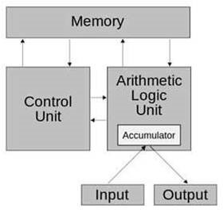

# unit1

main

- Introduction to Programming Languages
- Programming language definition
- Imperative Languages
- Data Oriented Languages
- Object Oriented Languages
- Non-imperative languages
- Basic Computer Architecture
- von Neumann architecture
- Alan Turing and the Turing Machine
- Alonzo Church and the Lambda Calculus

ja

- プログラミング言語入門
- プログラミング言語の定義
- 命令型言語
- データ指向型言語
- オブジェクト指向型言語
- 非命令型言語
- 基本的なコンピュータアーキテクチャ
- ノイマンアーキテクチャ
- アラン・チューリングとチューリングマシン
- アルonzoチャーチとラムダ計算

## Goal

main

- Define programming languages
- Understand the history and evolution of programming languages
- Describe programming language paradigms (imperative, data oriented, object oriented, non-imperative)
- Understand and be able to describe the von Neumann architecture and how it contributes to a theory of computing
- Understand and be able to describe how the concept of the Turing Machine and Church’s Lambda calculus contribute to the theory of computability and the Turing-Church thesis

ja

- プログラミング言語を定義する
- プログラミング言語の歴史と進化を理解する
- プログラミング言語のパラダイム（命令型、データ指向型、オブジェクト指向型、非命令型）を説明する
- フォン・ノイマン・アーキテクチャを理解し、それがコンピューティング理論にどのように貢献しているかを説明できる
- チューリングマシンとチャーチのラムダ計算の概念が、計算可能性理論とチューリング・チャーチテーゼにどのように貢献しているかを理解し、説明できる

## Task

- [x] Reading assignment
- [x] Discussion Forum
  - [x] first post
  - [x] reply classmates
- [x] Exercise assignmet
- [x] Learning Journal
- [x] Take Self-Quiz
  - [x] Self-Quiz 1: History and Evolution of Programming Languages
  - [x] Self-Quiz 2: von Neumann, Church, and Turning
  - [x] Self-Quiz 3: Programming language paradigms

## Reading Assignment

- Ben-Ari, M. (2006). Understanding programming languages. Weizman Institute of Science.
  - Read the following chapters:
- Chapter 1 - What Are Programming Languages
- Chapter 2 - Elements of Programming Languages
- John von Neumann and von Neumann Architecture for Computers (1945) by Barney J. Cabrera of Salem State University: <https://archive.ph/yyGL0>
- Computer Languages History <http://www.levenez.com/lang/>
- The History of the Development of Programming Languages by Steve Meyer available at <http://www.softpanorama.org/History/lang_history.shtml>
- The History of Programming Languages available at <http://jcsites.juniata.edu/faculty/rhodes/lt/plhistory.htm>
- Topics in History and Comparing Programming Languages by Dennie Van Tassel available at <http://www.gavilan.edu/csis/languages/history.html>
- Turing Machines by David Barker-Plummer, The Stanford Encyclopedia of Philosophy (Fall 2012 Edition), Edward N. Zalta (ed.): <http://plato.stanford.edu/archives/fall2012/entries/turing-machine/>

## Discussion Forum

Describe the differences between an imperative programming language and a non-imperative programming language.  You must provide examples of each type of language as part of your response.   Further, discuss an example of where you would use an imperative language and a situation where a non-imperative language would be better.  You discussion must explain why the selected language makes sense.

命令型プログラミング言語と非命令型プログラミング言語の違いを説明してください。それぞれのタイプの言語の例も回答に含める必要があります。さらに、命令型言語が適している場面の例と、非命令型言語がより適している状況の例についても議論してください。なぜその選択した言語が適しているのかを説明する必要があります。

### Japanese Discussion

導入
プログラミング言語は、命令型と非命令型の2つの主要なカテゴリに分類され、それぞれが異なるプログラミングスタイルと用途を提供します。命令型言語はプログラムの流れを逐次的な命令で制御するのに対し、非命令型言語はより宣言的なアプローチを採用します。本稿では、それぞれの特徴と利用例を具体的に説明し、適切な活用シーンについて考察します。

命令型プログラミング言語
命令型プログラミング言語は、プログラムを一連の命令として記述し、コンピュータに何をすべきかを順序立てて指示します。このスタイルでは、状態変化や手続きの流れを明示的に表現することが特徴です（Ben-Ari, 2006）。例えば、C++ や Python は命令型言語の代表例であり、システム開発やパフォーマンスが重要なアプリケーションで広く使用されています。
具体例として、グラフィックス処理が挙げられます。例えば、ゲームや3Dモデリングソフトウェアの開発では、逐次的な計算と状態管理が必要となります。C++ を用いることで、高速なレンダリングや複雑な物理シミュレーションが可能です。Zyda (2005) の研究によれば、命令型プログラミングはリアルタイム性が求められるグラフィックスアプリケーションにおいて、そのパフォーマンスと制御性の面で有効性が示されています。

非命令型プログラミング言語
一方、非命令型プログラミング言語は「何を達成したいか」を宣言的に記述し、処理の具体的な実行方法を明示する必要がありません。このカテゴリには、関数型プログラミングや宣言型プログラミングが含まれます。Haskell や SQL は非命令型言語の例であり、それぞれ科学計算やデータベース管理で効果を発揮します。
具体例として、宣言的データ変換が求められるウェブ開発が挙げられます。例えば、テンプレートエンジンを使用して動的ウェブページを生成する際、データの操作とビューの生成をシンプルに記述できます。SQL を使用したデータクエリも、非命令型言語の代表的な用途です。Barker-Plummer (2012) の研究では、非命令型言語の宣言的アプローチが、大規模システムの設計において保守性を高める効果があるとされています。

具体的な利用例の比較
命令型言語は、リアルタイム処理や逐次的な制御が必要な場面で強みを発揮します。グラフィックス処理やゲーム開発など、複雑なアルゴリズムを逐次実行する際に適しています。一方、非命令型言語は、シンプルで宣言的な記述が求められる場面に適しています。例えば、ウェブアプリケーションのテンプレートエンジンやデータベース操作においては、非命令型アプローチのほうがコードの可読性や保守性が向上します。

結論
命令型言語と非命令型言語は、それぞれ異なる強みを持ち、用途に応じて適切に選択することが求められます。命令型言語は逐次処理と状態管理に優れ、パフォーマンスが重視される場面で有効です。一方、非命令型言語は宣言的な操作を得意とし、可読性と保守性を重視した設計に適しています。これらの言語の使い分けは、プロジェクトの要件と目標に応じて最適化されるべきです。

参考文献
Ben-Ari, M. (2006). Understanding programming languages. Weizman Institute of Science.
Zyda, M. (2005). From visual simulation to virtual reality to games. Computer, 38(9), 25-32. <https://doi.org/10.1109/MC.2005.297>
Barker-Plummer, D. (2012). Turing Machines. The Stanford Encyclopedia of Philosophy (Fall 2012 Edition), Edward N. Zalta (ed.). Retrieved from <http://plato.stanford.edu/archives/fall2012/entries/turing-machine/>

## Exercise Assignment

### Excercise 1: Turing Machine Program for Binary Addition

Using the Anthony Morphett Turing machine simulator (see URL) load the program to add two binary numbers.  Enter two binary numbers  as follows:

1000  0001

Make sure you ‘reset’ the machine.  The starting point of the data in the machine should be your two binary numbers.  In decimal the first number 1000 is equivalent to 8, the second number 0001 is equivalent to 1.  Obviously adding them together should result in decimal 9 which is 1001 in binary.  Execute this program by ‘stepping’ through it.  Try to determine how the machine is operating.  Try to determine how the registers x and y are being used.  Determine how many steps are required to complete your program’s processing.

Turing Machine Simulator by Anthony Morphett: <http://morphett.info/turing/turing.html>

### Exercise 2: von Neumann Computer Simulator

John von Neumann and the computer architecture that bears his name incorporate the basic idea of a flexible general purpose computing device (computer) where both instructions and the data they operate upon were stored in memory (stored-program computer).  The basic von Neumann computer had memory, an ALU (arithmetic logic unit), which contained an accumulator (a kind of register to temporarily hold values) and a control unit, which controls the execution of a program loaded into memory.  It is the responsibility of the control unit to fetch instructions from memory and load them into the ALU for processing.

In processing a program the control unit will retrieve the appropriate instructions which are stored in memory numerical op codes or machine codes that represent specific instructions that the ALU knows how to process.  The control unit initiates input-output operations such as getting input from the user and sending output to the user.   Although not well documented in the preceding diagram, the arrows indicate the flow of data or instructions and the arrows are actually implemented within the computer as electrical connections that can send bits of data between the memory, control unit, ALU, input, and output.   These connections are commonly referred to as busses.

The Little Man Computer simulator provides a simplified implementation of von Neumann’s architecture.  Using the simulator available at York University (<http://www.yorku.ca/sychen/research/LMC/index.html>),

run the “LMC Add and Subtract Instructions” program to gain an understanding of how the von Neumann architecture works.   You should first review the link for the program and the instructions for how to load, compile, and execute this program.   To start the process, start the simulator.  To do this exercise you must have a browser with a java plugin that can run a java applet.  Copy the “LMC Add and Subtract” program by copying it from the web page and pasting it into the message box of the LMC simulator.  Next hit the compile button.

You should see the program translated (compiled) into a series of numbers and loaded into the memory starting in memory location 0 through location 7.   Let’s look at what the contents of the memory means:

Location 0: 901  - load a value from in box into the accumulator
Location 1: 309  - store (instruction 3)accumulator value to memory location 09
Location 2: 901  - load a value from in box into the accumulator
Location 3: 109  - add (instruction 1) value in memory location 09 to accumulator
Location 4: 902  - Instructs the ALU to send the value in the accumulator to the out box
Location 5: 901  - load a value from in box into the accumulator
Location 6: 209  - subtract (instruction 2) value in memory location 09 from the
Location 7: 902  - Instructs the ALU to send the value in the accumulator to the out box

A list of the available instructions (definitions of what the instructions in the memory location) can be found <http://www.yorku.ca/sychen/research/LMC/LMCInstructions.html>

When running the program, I recommend that you use the ‘step’ function to step through the program one instruction at a time. The current instruction being executed is highlighted in yellow to make it easy to see what is being processed.  Pay close attention to memory location 09 as several instructions move data into or out of that memory location.  Also pay attention to the in-box, out-box, and the accumulator, which is used as the register that instructions operate against.

Little Man Computer Simulation: <http://www.yorku.ca/sychen/research/LMC/index.html>

Upon completing this assignment, you should have an understanding of the basic operation of the von Neuman computer architecture.

### Exercise 3: 99 Bottles of Beer

The following exercise is a bit of fun.  The following web site provides an interesting way to compare different programming languages.  The song 99 bottles of beer has been implemented as a repetitive algorithm where the lyrics of the song are counted down from 99 bottles of beet to 98 bottles of beer and so on until there are no bottles of beer left!

<http://www.99-bottles-of-beer.net/>

This simple algorithm has been implemented, by contributors to the web site, using literally hundreds of different programming languages.  Although a simple example, the site provides us with an excellent way to see the properties and features of different programming languages to solve the same computing problem.  As part of this exercise, review the programming problem defined by the site and then review the solution of the problem as implemented in several different programming languages.  As this course will explore both imperative and non-imperative programming languages I would suggest that you review examples of both imperative and non-imperative programming language solutions.   Some suggestions to get you started (but should not be the only languages that you review) include:

Algol 68  - Example of imperative programming language
Basic - Example of programming language featuring ‘spaghetti code’
Java 2 Micro Edition   - Example of object-oriented programming language
Cobol   - Example of early imperative programming language
Haskell - Example of functional programming language
Prolog  - Example of logic programming language
Perl   - Example of scripting programming language
Assembler  - Example of assembler

### Japanese Exercise Assignment

## Learning Journal

The Learning Journal is a tool for self-reflection on the learning process. In addition to completing directed tasks, you should use the Learning Journal to document your activities, record problems you may have encountered and to draft answers for Discussion Forums and Assignments. The Learning Journal should be updated regularly (on a weekly basis), as the learning journals will be assessed by your instructor as part of your Final Grade.

Your learning journal entry must be a reflective statement that considers the following questions:

1. Describe what you did. This does not mean that you copy and paste from what you have posted or the assignments you have prepared.  You need to describe what you did and how you did it.
2. Describe your reactions to what you did
3. Describe any feedback you received or any specific interactions you had.  Discuss how they were helpful
4. Describe your feelings and attitudes
5. Describe what you learned

Another set of questions to consider in your learning journal statement include:

1. What surprised me or caused me to wonder?
2. What happened that felt particularly challenging? Why was it challenging to me?
3. What skills and knowledge do I recognize that I am gaining?
4. What am I realizing about myself as a learner?
5. In what ways am I able to apply the ideas and concepts gained to my own experience?
6. Finally, describe one important thing that you are thinking about in relation to the activity.

### Japanese Learning Journal

1. 今週の概要
今週は、プログラミング言語と基本的なコンピュータアーキテクチャの歴史と進化について学びました。具体的には、プログラミング言語の定義とそのパラダイム（命令型、データ指向、オブジェクト指向、非命令型）を理解し、ジョン・フォン・ノイマン、アラン・チューリング、アロンゾ・チャーチの業績が現代のコンピュータサイエンスと計算理論にどのように貢献したかを学びました。また、チューリングマシンとラムダ計算が理論計算可能性およびチューリング＝チャーチの提案にどのように関連するかも学びました。
2. 自分の感想
これまでにPythonやJavaを通じてプログラミング言語を学んできたことが、今回の学習内容を理解する上での基盤となり役立ちました。特に、命令型言語と非命令型言語の違いについて学ぶ中で、関数型プログラミングの概念が新たな視点を提供してくれたように感じました。関数型言語は状態の変更を伴わず、数学的な関数評価に基づいて問題を解決するという点で、命令型言語と根本的に異なるアプローチを取っています。このアプローチがもたらすコードの簡潔性と抽象性は非常に魅力的でした。
また、フォン・ノイマンアーキテクチャやチューリングマシンの理論が、現在使用しているコンピュータの基盤としてどのように機能しているのかを改めて学ぶことができました。特に、チューリングマシンが計算可能性の概念を理論的に定義する方法には深い感銘を受けました。一方で、ラムダ計算の数学的な側面については理解するのに時間がかかりましたが、これが関数型プログラミング言語の基盤を形成していることを知り、その意義を感じることができました。
3. 特に深く学習したこと
1つ目は、命令型言語と非命令型言語の比較です。
命令型言語では、手続き的なアプローチを取り、プログラムの流れや状態を詳細に制御します。これに対し、非命令型言語は、問題の解法そのものを定義するアプローチを取り、計算の流れをプログラマが直接制御する必要がありません。この違いを学んだことで、それぞれの言語が持つ利点と課題を理解することができました。命令型言語の利点は効率性にあり、一方で非命令型言語は抽象性と可読性に優れています。ただし、非命令型言語の実装効率の問題も現実的な制約として存在しており、実際のプロジェクトでの使い分けが重要だと感じました。
2つ目は、チューリングマシンとラムダ計算の役割です。
チューリングマシンは、計算可能性を形式的に表現するための手段として設計されており、その理論的なシンプルさが計算理論の基礎を築いています。特に、状態とデータ操作の概念が計算をモデル化するための鍵となっている点が重要でした。一方、ラムダ計算は、数学的な関数を利用して計算をモデル化するアプローチであり、関数型プログラミング言語に直接影響を与えています。この2つの異なるアプローチが、計算可能性の理論的な完全性を示す「チューリング＝チャーチの提案」に繋がったことは非常に興味深いと感じました。
4. 今後の課題と来週に向けて
来週の学習では、以下の課題に取り組む予定です：

- BNFやEBNFモデルの理解
構文解析の基礎となるこれらのモデルを学び、プログラミング言語の構文がどのように形式化されているのかを深く理解したいと考えています。

- 型チェックの重要性の理解
静的型付けと動的型付けの違い、さらに強い型付けと弱い型付けの特徴を比較し、プログラミング言語の設計やデバッグにおける型の役割を明確にすることを目指します。

- 仮想マシンモデルの比較
Java仮想マシンだけでなく、UnixやIBMの仮想マシンモデルについても学び、それぞれの特徴がプログラミングにどのような影響を与えるかを探求します。特に、仮想マシンが移植性や効率性にどのように寄与しているのかを明確にしたいと考えています。

これらの課題を通じて、プログラミング言語の理論的な基盤をさらに強化し、実践的な応用力を高めていきたいと思います。
