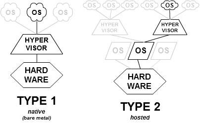

# unit2

- Elements of Programming Languages
  - Syntax
    - BNF and EBNF model
    - Grammars
    - Parsing
  - Semantics
  - Data and Assignments
  - Type checking
- Programming Environments
  - Compiler versus Interpreter
  - The Java Model
  - Virtual Machines

## Goal

main

- Identify the basic structure and components of programming languages
- Understand the basic concepts of syntax and semantics in programming languages
- Understand types and type checking
- Understand the differences between compilers and interpreters
- Understand the steps in compilation
- Understand the different virtual machine models

ja

- プログラミング言語の基本構造と構成要素を特定する
- プログラミング言語における構文と意味の基本概念を理解する
- 型と型チェックを理解する
- コンパイラとインタプリタの違いを理解する
- コンパイルの手順を理解する
- さまざまな仮想マシンモデルを理解する

## Task

- [x] Reading assignment
- [x] Discussion Forum
  - [x] first post
  - [x] reply classmates
- [x] Exercise assignmet
- [x] Learning Journal
- [x] Take Self-Quiz

## Reading Assignment

Ben-Ari, M. (2006). Understanding programming languages. Weizman Institute of Science.
  Read the following chapters:
    Chapter 2 - Elements of Programming Languages
    Chapter 3 - Programming Environments

Read Chapters 1-4 in Compiler Construction. Copyright © 2017 by Niklaus Wirth.  Available at: <https://people.inf.ethz.ch/wirth/CompilerConstruction/CompilerConstruction1.pdf>

Introduction to Virtual Machines by Eric Kohlbrenner, Dana Morris, and Brett Morris of George Mason University. Download here.

Introduction to Data Types: Static, Dynamic, Strong & Weak by Tim Hurd (2021):  <http://www.sitepoint.com/typing-versus-dynamic-typing/>

## Discussion Forum

In your own words, describe the steps of compilation described by Niklaus Wirth in his 2005 text “Compiler Construction”.  You must include a description of what a ‘Context Free Grammar’ is, and how it relates to the compilation process.

You are expected to make a minimum of 3 responses to your fellow student’s posts.

ニクラウス・ヴィルトが2005年に発表した「Compiler Construction」で説明したコンパイルの手順を、自分の言葉で説明してください。回答には、「文脈自由文法」が何であるか、そしてそれがコンパイルプロセスにどのように関連しているかを含める必要があります。

また、同級生の投稿に対して、最低3回の返信を行うことが求められています。ニクラウス・ヴィルトが2005年に発表した「Compiler Construction」で説明したコンパイルの手順を、自分の言葉で説明してください。回答には、「文脈自由文法」が何であるか、そしてそれがコンパイルプロセスにどのように関連しているかを含める必要があります。

また、同級生の投稿に対して、最低3回の返信を行うことが求められています。

### Japanese Discussion

## Exercise Assignment

### Unit 2 Exercise 1:  Fun with Type Checking

In the following exercise, we will look at static versus dynamic type checking and strong versus weak typing.   In this exercise, we will use the IDEONE.com environment to demonstrate dynamic and static typing and strong versus weak typing. The IDEONE.com site can be used for both the Python and Java examples and can be accessed at <http://ideone.com/>.

Select PHP as the language within the IDEONE site, and enter the following PHP script.  You will notice that what we are doing in this script is three different type values to the same variable.  First, we assign the floating point number, 5.5 to the variable $num.  We then assign 5 to the same variable $num and finally, we assign the word ‘five’.  If PHP were a strongly typed language this action would give us an error because we are declaring a type for a variable and then using the same variable for another type.  If you enter this program and execute it, you will  find that the program runs without error in PHP because it is both Dynamically typed (we can use the variable before we declare its type) and Weakly typed (we can use the same variable for another data type because the interpreter implicitly converts the type).

```php
<?php
   $num = 5;
   $num = 5.5;
   echo $num;
   print "\n";
   $num2 = 5;
   echo $num+$num2;
   print "\n";
   $num3 = 'five';
   echo $num+$num3;
   print "\n";
?>
```

When you execute this code what you will see is that the compiler will implicitly make decisions on how to interpret the types of data within the variables.  If PHP was a strongly typed language, attempting to bind a value to a variable of a different type should produce an error but it doesn’t because PHP is dynamically typed.  Further attempting to evaluate an operation where we are adding a numeric type to a string type should also produce an error but it does not because the interpreter decides how to deal with the situation.   The following example shows this in a different way as the interpreter decides to parse a string that contains both a numeric component and string component and use just the numeric part to evaluate the expression.

```php
<?php
  $num = 5;
  echo $num;
  print "\n";
  $num2= '5a';
  echo $num+$num2;
?>
```

In contrast, we will look at the Java language.  Java, unlike Python, is neither dynamically or weakly typed.  The type of variables must be declared before they are used and once declared the variable cannot be used to hold another data type.  Consider the following short program.  In this program, you can see that we are attempting to use the variable ‘num’ before it has been declared.   We attempt to assign the value to the variable.

```java
public class Main{
  public static void main(String args[]){
        num=5;
        System.out.println(num);
        num=5.5;
        System.out.println(num);
  }
}
```

As you can see (in the following output), the java compiler will not compile the code because Java is a statically typed language.  The compiler requires that variables be declared before use.  In this case, the compiler will not even compile the code.  The output of attempting to compile the preceding code can be seen below.

```java
Main.java:3: cannot find symbol
symbol  : variable num
location: class Main
        num=5;
        ^
Main.java:4: cannot find symbol
symbol  : variable num
location: class Main
        System.out.println(num);
                           ^
Main.java:5: cannot find symbol
symbol  : variable num
location: class Main
        num=5.5;
        ^
Main.java:6: cannot find symbol
symbol  : variable num
location: class Main
        System.out.println(num);
```

In the next example, we have corrected the problem by declaring the value of num to be an integer.  However as you can see we then attempt to assign a value of 5.5 to the variable, which is a floating point number and not an integer, we encounter an error.

```java
public class Main{
  public static void main(String args[]){
        int num=5;
        System.out.println(num);
        num=5.5;
        System.out.println(num);
  }
}
```

The output of attempting to compile the preceding code can be seen below.

```error
Main.java:5: possible loss of precision
found   : double
required: int
        num=5.5;
            ^
1 error
```

What we see in this example is the fact that Java recognizes that we are attempting to store a floating-point number into an integer variable and it is preventing this from happening.  This example demonstrates a ‘strongly’ typed language in that it will not allow a variable to be used for any type other than the one it has been declared for.   Execute this final example and analyze the outcome.

```java
public class Main{
 public static void main(String args[]){
   int num=5;
   double num2 = 5.5;
   int num3;
   num3 = num + num2;
   System.out.println(num3);
 }
}
```

We have looked at two examples in this exercise.  One is weakly and dynamically typed.  The other is strongly and statically typed.  There are other examples that we could examine as well.  For example, there are languages that are both dynamic and strongly typed.  There are also languages (such as C) that are statically typed and dynamic through the use of casts.  As a follow on to this exercise, conduct research on the internet to find more examples of a programming language that fits each of the different types including:

Strongly typed and statically typed
Strongly typed and dynamically typed
Weakly typed and statically typed
Weakly typed and dynamically typed

### Unit 2 Exercise 2:  Virtual Machine Type 1 and Type 2 Hypervisors

In this unit, we will look at different models of virtualization.  One method of implementing virtualization is with a hypervisor.  There are two types of hypervisors, which are labeled as type 1 and type 2.   Type 1 hypervisors (Xen, Vmware ESX, and Microsoft Hyper-V are all examples of type 1 hypervisors) are designed to be the base ‘operating system’ that runs on a physical computer.  The type 1 hypervisor abstracts the underlying hardware and coordinates access of multiple ‘guest’ operating systems to the hardware.  In this virtualization model, the hypervisor is a traffic cop that allocates the available hardware resources between the different guest operating systems that are running.



The type 2 hypervisor runs on top of an operating system as a process.  This type of hypervisor can emulate either the underlying hardware or some other hardware since the hypervisor acts to translate the instructions from the operating systems running upon it. There are many examples of this type of hypervisor including the Vmware player software and Oracle’s VirtualBox.
As part of this exercise, review the following two solutions.  Consider the advantages and disadvantages of each use the following resources to conduct your research.  There is no specific requirement of this exercise other than to review the following materials and attempt to gain an understanding of each type of virtualization solution represented:

- Overview of Hypervisors: <http://publib.boulder.ibm.com/infocenter/eserver/v1r2/topic/eicay/eicay.pdf>
- Type 1 Hypervisor: Xen hypervisor <http://xen.org/>
- Type 2 Hypervisor: Oracle VirtualBox <http://www.virtualbox.org>

Finally, review the KVM virtualization solution.  Consider how would you classify this solution. Is it Type 1 or Type 2? <http://www.linux-kvm.org/page/Main_Page>

### Japanese Exercise Assignment

## Learning Journal

The Learning Journal is a tool for self-reflection on the learning process. In addition to completing directed tasks, you should use the Learning Journal to document your activities, record problems you may have encountered and to draft answers for Discussion Forums and Assignments. The Learning Journal should be updated regularly (on a weekly basis), as the learning journals will be assessed by your instructor as part of your Final Grade.
Your learning journal entry must be a reflective statement that considers the following questions:

- Describe what you did. This does not mean that you copy and paste from what you have posted or the assignments you have prepared. You need to describe what you did and how you did it.
- Describe your reactions to what you did
- Describe any feedback you received or any specific interactions you had. Discuss how they were helpful
- Describe your feelings and attitudes
- Describe what you learned

Another set of questions to consider in your learning journal statement include:

- What surprised me or caused me to wonder?
- What happened that felt particularly challenging? Why was it challenging to me?
- What skills and knowledge do I recognize that I am gaining?
- What am I realizing about myself as a learner?
- In what ways am I able to apply the ideas and concepts gained to my own experience?

Finally, describe one important thing that you are thinking about in relation to the activity.
Answer all questions that apply, however, you are expected to complete the Learning Journal assignment in 400-600 words.

### Japanese Learning Journal
