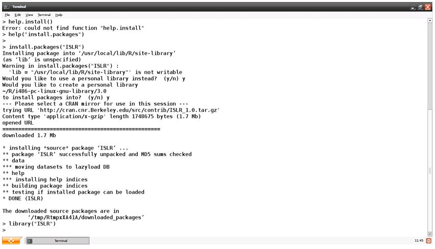
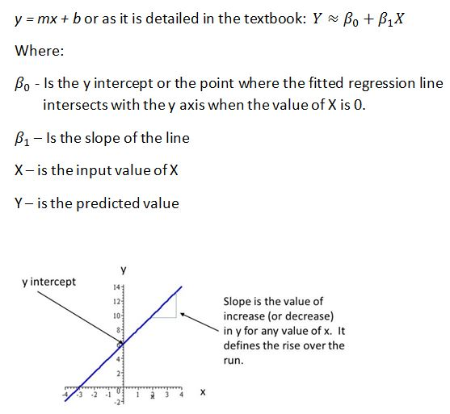
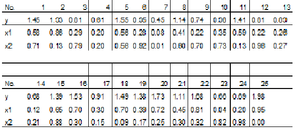
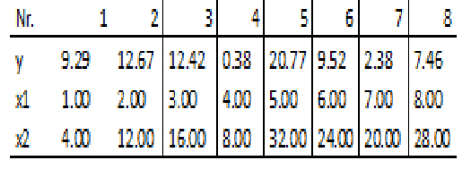

# unit3

- Regression
- Supervised learning
- Predicting the future with data from the past
- Plotting pointsz
- Line fitting
- Minimizing Error
- Linear, curvilinear, and logistic regression

## Goal

main

- Describe the difference between Linear, Curvilinear and Logistic regression.
- Understand the functioning of the linear regression algorithm.
- Analyze linear data with regression using R.

ja

- 線形回帰、曲線回帰、ロジスティック回帰の違いを説明できる。
- 線形回帰アルゴリズムの機能を理解する。
- Rを使用して回帰分析による線形データの分析を行う。

## Task

- [x] Reading assignment
- [x] Peer Assessment
- [x] Discussion Forum
  - [x] first post
  - [x] reply classmates
- [x] Programming Assignment
- [x] Learning Journal
- [x] Take Self-Quiz
- [x] Take Graded-Quiz

## Reading Assignment

James, G., Witten, D., Hastie, T., & Tibshirani, R. (2013).  An Introduction to Statistical Learning with Applications in R. New York, NY: Springer.  Read Chapter 3 (Download the book from the syllabus or textbook session)

## Discussion Forum

Regression is statistical technique that uses past data to make a future prediction. Conduct research on the internet, the University of the People library or other resources that are academically reliable (The Directory of Open Access Journals and Google Scholar are good resources) develop a post that explains the key limitations of regression. A part of your response should address the limitation of the ‘range’ that regression analysis can predict.

回帰分析は過去のデータを使用して未来の予測を行う統計技術です。インターネット、University of the Peopleのライブラリ、または他の学術的に信頼できるリソース（例：オープンアクセスジャーナルのディレクトリやGoogle Scholar）を活用し、回帰分析の主要な制約を説明する投稿を作成してください。回答の一部には、回帰分析が予測可能な「範囲」の制約についても言及する必要があります。

### Japanese Discussion

**導入**
回帰分析は、過去のデータを基に未来を予測するための基本的かつ強力な統計手法です。その直感的な理解のしやすさと実用性により、マーケティング、経済学、医療などの分野で広く採用されています（James et al., 2013）。特に線形回帰は、シンプルなモデルでありながら、複雑な予測問題の出発点として重要です。しかし、回帰分析は万能ではなく、その制約を理解しないまま適用すると誤った結論を導くリスクがあります。本稿では、回帰分析の主要な制約について解説し、とりわけ「予測可能な範囲」の問題に焦点を当てます。

**回帰分析の制約**
a. 線形性の仮定 (Assumption of Linearity)
回帰分析は、独立変数と従属変数の間に線形関係があることを前提としています。この仮定が現実のデータに適合しない場合、予測精度が著しく低下する可能性があります（Gelman & Hill, 2006）。例えば、販売データや広告費データが非線形の関係を持つ場合、単純な線形モデルでは正確な予測が難しくなります。

b. 外れ値やノイズの影響 (Impact of Outliers and Noise)
外れ値やデータノイズは、回帰モデルに大きな影響を与える要因です。外れ値が存在すると、最小二乗法で計算される回帰係数が歪むため、モデルの予測性能が低下します。これを防ぐには、外れ値の除去やデータクリーニングの実施が重要です（James et al., 2013）。

c. 多重共線性 (Multicollinearity)
複数の説明変数間に高い相関が存在すると、モデルの解釈性が損なわれます。これにより、回帰係数の値が不安定になるだけでなく、予測精度にも悪影響を与える可能性があります（James et al., 2013）。

d. 範囲の制約 (Limitation of Range in Prediction)
回帰分析の最も顕著な制約の一つが、訓練データの範囲外での予測、いわゆる外挿の問題です。回帰モデルは、訓練データ内の範囲（内挿）では比較的高い精度を示しますが、この範囲を超えた予測は信頼性に欠けます（Hastie et al., 2009）。例えば、広告予算が過去に観測された最大値を大きく超える場合、モデルは現実的ではない予測をする可能性があります。

**データ範囲の具体例**
「Advertising」データセットを使用した回帰分析の例では、テレビ広告費が過去のデータの範囲を超える場合、モデルが極端に楽観的な予測を生成することが確認されています（James et al., 2013）。これは、モデルが訓練データ内のパターンに基づいて学習しているため、未知のデータポイントに対して適切に一般化できないことに起因します。このような状況を回避するためには、訓練データを拡張したり、非線形モデルやベイズ回帰などの手法を検討することが推奨されます。

**回帰分析の有効な活用法と結論**
回帰分析を正しく活用するには、データの前処理、モデルの仮定の検証、そしてモデルの選択が重要です。例えば、線形関係が成り立たない場合、非線形モデルや機械学習アルゴリズムを補助的に利用することで、予測精度を向上させることができます（Hastie et al., 2009）。結論として、回帰分析は実用的で強力なツールである一方、その制約を理解し、他の手法と組み合わせて活用することが重要です。

参考文献
Gelman, A., & Hill, J. (2006). Data Analysis Using Regression and Multilevel/Hierarchical Models. Cambridge University Press.
Hastie, T., Tibshirani, R., & Friedman, J. (2009). The Elements of Statistical Learning: Data Mining, Inference, and Prediction. Springer.
James, G., Witten, D., Hastie, T., & Tibshirani, R. (2013). An Introduction to Statistical Learning: With Applications in R. Springer.

## Programming Assignment

Follow the lab instructions in section 3.6 in the textbook for linear regression.   If you are using an instance of R that is installed on your local computer then you may need to install either the MASS package or the ISLR package.   A video tutorial has been provided in this unit to help you understand the installation procedure for instances of R installed on windows systems.

If you are using the Virtual Computing Lab, you may also be required install the packages.  To install a package, simply issue the following command from the R command prompt.  Note that this command installs the ISLR package but you can specify any package that is required.

> Install.packages(“ISLR”)

An example of the installation process is shown in the following screen shot.  When prompted to create a personal library you should respond “Y”.



As you follow the instructions for the Lab you will recognize that the lm.fit command is a function that has been developed to generate the linear regression model.  The function can accommodate a single or multiple predictor variables meaning that it can do both single linear regression or multiple linear regression.
The output provided by the lm.fit command provides us with the ‘fit’ data to complete the regression model.   You will recall from your reading that linear regression models take the form of a line which is expressed as:



Follow the instructions for the lab.  In it the predicted value is medv and the predictor value is lstat.  When you run the lm.fit command it will output the Intercept and the β1 value that is multiplied with the predictor value in our equation.
In the example in our textbook, the intercept will be 34.55 and the lstat value will be -0.95. This fits into our line equation as follows:

y = 34.44 + (-0.95 ⁎ X)

EXERCISES: Multiple Linear Regression Exercises
The following measurements have been obtained in a study:



It is expected that the response variable y can be described by the independent variables x1 and x2. This imply that the parameters of the following model should be estimated and tested.

Yi = β0 + β1x1 + β2x2 + єi,  єi~N(0,σ2)

a) Calculate the parameter estimates (β0, β1, β2 and σ2), in addition find the usual 95% confidence intervals for β0, β1, and β2.
You can copy the following lines to R to load the data:

D <- data.frame(
    x1=c(0.58, 0.86, 0.29, 0.20, 0.56, 0.28, 0.08, 0.41, 0.22, 0.35,
             0.59, 0.22, 0.26, 0.12, 0.65, 0.70, 0.30, 0.70, 0.39, 0.72,
             0.45, 0.81, 0.04, 0.20, 0.95),
    x2=c(0.71, 0.13, 0.79, 0.20, 0.56, 0.92, 0.01, 0.60, 0.70, 0.73,
             0.13, 0.96, 0.27, 0.21, 0.88, 0.30, 0.15, 0.09, 0.17, 0.25,
             0.30, 0.32, 0.82, 0.98, 0.00),
      y=c(1.45, 1.93, 0.81, 0.61, 1.55, 0.95, 0.45, 1.14, 0.74, 0.98,
             1.41, 0.81, 0.89, 0.68, 1.39, 1.53, 0.91, 1.49, 1.38, 1.73,
             1.11, 1.68, 0.66, 0.69, 1.98)
)

b) Still using confidence level α = 0.05 reduce the model if appropriate.
c) Carry out a residual analysis to check that the model assumptions are fulfilled.
d) Make a plot of the fitted line and 95% confidence and prediction intervals of the line for x1 ϵ [0, 1] (it is assumed that the model was reduced above).

MLR simulation exercise
The following measurements have been obtained in a study:



a) Plot the observed values of y as a function of x1 and x2. Does it seem reasonable that either x1 or x2 can describe the variation in y?

You may copy the following lines into R to load the data

D <- data.frame(
     y=c(9.29,12.67,12.42,0.38,20.77,9.52,2.38,7.46),
     x1=c(1.00,2.00,3.00,4.00,5.00,6.00,7.00,8.00),
     x2=c(4.00,12.00,16.00,8.00,32.00,24.00,20.00,28.00)
)

b) Estimate the parameters for the two models

Yi = β0 + β1x1,i + єi,  єi~N(0,σ2)

And

Yi = β0 + β1x2,i + єi,  єi~N(0,σ2)

and report the 95% confidence intervals for the parameters. Are any of the parameters significantly different from zero on a 95% confidence level?

以下はアップロードされた質問の日本語訳です。

---

**提出指示**  
教科書のセクション3.6に記載されている線形回帰に関するラボ指示に従ってください。ローカルコンピュータにインストールされたRを使用している場合、「MASS」パッケージまたは「ISLR」パッケージをインストールする必要がある場合があります。このユニットには、WindowsシステムにインストールされたRのインストール手順を理解するのに役立つビデオチュートリアルが提供されています。

**演習：多重線形回帰演習**  
以下のデータが研究で得られています：

**モデル**  
\[
Y = β_0 + β_1 x_1 + β_2 x_2 + ε, \quad ε \sim N(0,σ^2)
\]

a) 以下のパラメータを計算し、95%信頼区間を求めてください：  

- \( β_0, β_1, β_2, σ^2 \)

Rでデータを読み込むには以下のコードをコピーしてください：

```R
D <- data.frame(
  x1=c(0.58, 0.86, 0.29, ...),
  x2=c(0.71, 0.13, 0.79, ...),
  y=c(1.45, 1.93, 0.81, ...)
)
```

b) 信頼レベル \( α = 0.05 \) を用いて、必要に応じてモデルを簡略化してください。

c) 残差分析を行い、モデルの仮定が満たされているか確認してください。

d) フィットされた線とその95%信頼区間および予測区間を \( x ∈ [0, 1] \) でプロットしてください。

**MLRシミュレーション演習**  
以下のデータが研究で得られています：

```R
D <- data.frame(
  y=c(9.29, 12.67, ...),
  x1=c(1.00, 2.00, ...),
  x2=c(4.00, 12.00, ...)
)
```

a) \( y \) の観測値を \( x_1 \) および \( x_2 \) の関数としてプロットし、どちらかの変数で \( y \) の変動を説明できそうか評価してください。

b) 以下の2つのモデルのパラメータを推定し、95%信頼区間を求めてください：
\[
Y = β_0 + β_1 x_1 + ε, \quad ε \sim N(0,σ^2)
\]
\[
Y = β_0 + β_1 x_2 + ε, \quad ε \sim N(0,σ^2)
\]

また、どのパラメータが有意に0と異なるかを報告してください。

### Japanese Programming Assignment

#### 1. 導入

本課題では、線形回帰および多重線形回帰モデルを構築し、データ分析を行うことを目的としています。線形回帰モデルは、変数間の関係を数式として表現し、予測やデータの解釈に役立つ統計手法です。特に多重線形回帰では、複数の独立変数を用いることで、より複雑なデータの傾向を捉えることが可能です。
本課題において、まず与えられたデータセットを基にモデルを構築し、パラメータの推定と信頼区間の計算を行います。その後、必要に応じてモデルの簡略化を試み、残差分析を通じてモデルの仮定が満たされているかを検証します。最後に、フィットされた線とその95%信頼区間および予測区間を可視化します。
また、R言語の統計分析機能を活用し、lm.fit関数を用いてモデルを構築します。この関数は、単回帰および多重回帰の両方をサポートしており、モデル構築に必要なパラメータや適合データを提供します。加えて、本課題では指定されたRパッケージ（例: ISLR）をインストールし、必要なデータ操作および分析を実施します。
本レポートを通じて、線形回帰モデルの実用的な構築および解釈に加え、統計的仮定の検証方法についても深く理解を深めることを目指します。

#### 2. データの読み込みと準備

本課題では、与えられたデータをRを用いて読み込み、モデル構築の準備を行います。課題で指定されたデータセットは、3つの変数x1、x2、yで構成されています。これらの変数はそれぞれ、独立変数と従属変数を表しており、多重線形回帰モデルの構築に使用されます。
まず、以下のコードを用いてデータをRに読み込みます：

```R
D <- data.frame(
  x1=c(0.58, 0.86, 0.29, 0.20, 0.56, 0.28, 0.08, 0.41, 0.22, 0.35,
       0.59, 0.22, 0.26, 0.12, 0.65, 0.70, 0.30, 0.70, 0.39, 0.72,
       0.45, 0.81, 0.04, 0.20, 0.95),
  x2=c(0.71, 0.13, 0.79, 0.20, 0.56, 0.92, 0.01, 0.60, 0.70, 0.73,
       0.13, 0.96, 0.27, 0.21, 0.88, 0.30, 0.15, 0.09, 0.17, 0.25,
       0.30, 0.32, 0.82, 0.98, 0.00),
  y=c(1.45, 1.93, 0.81, 0.61, 1.55, 0.95, 0.45, 1.14, 0.74, 0.98,
      1.41, 0.81, 0.89, 0.68, 1.39, 1.53, 0.91, 1.49, 1.38, 1.73,
      1.11, 1.68, 0.66, 0.69, 1.98)
)
```

データが正しく読み込まれたことを確認するために、head()関数やsummary()関数を使用してデータの概要を表示します：

```R
head(D)
```

この手順により、データセットの正確性を確認し、次の分析ステップに進む準備が整います。

#### 3. モデルの構築とパラメータ推定(Question a)

与えられたデータを使用して多重線形回帰モデルを構築し、パラメータ推定を行います。この分析では、目的変数yを予測するために2つの独立変数x1およびx2を使用します。

**モデルの構築**
Rのlm()関数を用いて、以下のようにモデルを構築します:

Figure 1 モデルの構築

この結果から、モデルの回帰式は以下の表に表されます:
y =0.4335 + 1.653x1 + 0.0039x2
​
β0=0.4335
β1=1.6530
β2=0.0039

**パラメータの信頼区間**
各パラメータの95%信頼区間をconfint()関数を用いて計算しました：

Figure 2 パラメータの信頼区間

β0:[0.297,0.570]
β1:[1.455,1.851]
β2:[−0.151,0.159]
この結果から、β1は0を含まないため、x1がyに統計的に有意な影響を与えることが確認できました。一方で、β1は0を含んでおり統計的に有意な値ではありませんでした。

**分散の推定**
モデルの残差平方和(RSS)と分散(𝜎^2)を以下の手順で計算しました：

Figure 3 分散の測定

計算結果:
𝜎^2 = 0.01270523
この値は非常に小さく、モデルの残差が低く、予測精度が高いことを示しています。

#### 4. モデルの簡略化(Question b)

多重線形回帰モデルにおいては、不要な変数を削除することでモデルを簡略化し、解釈を容易にするとともに、過剰適合（オーバーフィッティング）を防ぐことができます。本課題では、信頼レベルα=0.05 を基準として、変数x1およびx2の有意性を評価しました。

**モデル簡略化の基準**
有意性の評価: 各変数のp値を確認し、p値が0.05未満であれば統計的に有意と判断します。
結果:
  x1: p値 =2.53×10^−14。非常に有意であり、yの予測に寄与すると判断できます。
  x2: p値 =0.958。信頼レベルよりも大きいため、統計的に有意ではなく、モデルから削除しても問題ない可能性があります。

**モデルの簡略化**
x2をモデルから除外し、簡略化したモデルを構築しました:

Figure 4 モデルの簡略化

**簡略化モデルの結果**
簡略化したモデルの回帰式は次の通りです：
y =0.4361 + 1.6512x1

β0=0.4361
β1=1.6512

**モデルの比較**
簡略化モデルを元のモデルと比較した結果、以下のことが分かりました：
x2を削除しても、決定係数や残差標準誤差にはほとんど変化が見られません。
モデルのシンプルさが向上し、解釈が容易になりました。

したがって、簡略化モデルは、元のモデルとほぼ同等の予測精度を維持しつつ、不要な変数x2を削除してモデルの簡素化を実現しました。

#### 5. 残差分析(Question c)

回帰モデルの妥当性を評価するためには、残差分析を通じてモデルが仮定する条件が満たされているかを確認する必要があります。本課題では、以下の3つのモデル仮定を検証しました：

残差の正規性: 残差が正規分布に従うこと。
独立性: 残差が互いに独立であること。
等分散性: 残差の分散が一様であること。

**残差プロット**
残差プロットを作成して、等分散性と独立性を視覚的に確認しました：

Figure 5 残差プロット

プロット結果では、残差が予測値に対してランダムに分布しており、等分散性と独立性が満たされていることを確認しました。

**正規性の検証**
残差が正規分布に従うかを確認するために、Q-Qプロットを作成しました：

Figure 6 Q-Qプロット

Q-Qプロットの結果、残差はほぼ直線上に並び、正規分布に従う仮定が概ね満たされていることを確認しました。また、シャピロ・ウィルク検定を実施して正規性を統計的に評価しました：

Figure 7 シャピロ・ウィルク検定

検定結果では、p値が0.05を超えたため、残差が正規分布に従うという帰無仮説を棄却できませんでした。

**残差の分布とヒストグラム**

残差の分布をヒストグラムで可視化しました：

Figure 8 残差の分布とヒストグラム

結果、残差の分布は対称性を示し、正規分布の仮定と一致することが確認されました。

**結論**
残差分析の結果、以下の点が確認されました：
残差は独立性と等分散性の仮定を満たしている。
残差は正規分布に従う仮定を概ね満たしている。
これらの結果から、簡略化モデルは仮定を満たしており、信頼できるモデルであると判断できます。

#### 6. プロット作成(Question d)

簡略化モデルを用いてフィットされた回帰線、およびその95%信頼区間と予測区間をプロットしました。

Figure 9 プロット作成

**プロットの解釈**
作成したプロットは以下の要素を含んでいます：

1. フィットされた回帰線（赤色の実線）
この線は、簡略化モデルによる予測値を表します。
データ点（青色）に対して非常に良く適合していることが確認できます。
2. 95%信頼区間（緑色の破線）
回帰線の上下にプロットされた範囲は、モデルの係数に基づく信頼区間を示しています。
この範囲内に実際の平均応答が含まれる確率は95%です。
3. 95%予測区間（オレンジ色の点線）
信頼区間より広い範囲で表示されており、個々の観測値が含まれる可能性のある範囲を示します。
モデルの予測の不確実性が考慮されています。

**結論**
プロットから以下のことが確認されました：
フィットされた回帰線はデータに非常に良く適合しており、モデルの説明力が高いことを示しています。
信頼区間と予測区間は適切に設定されており、モデルの妥当性を視覚的に裏付けています。

#### 7. MLRシミュレーション演習

与えられたデータを基に、2つの多重線形回帰モデルを構築し、モデルの適合度やパラメータの有意性を評価しました。また、観測値と予測値の視覚化を通じてモデルの妥当性を検討しました。

**データの読み込みとモデル構築**
与えられたデータをもとに2つの回帰モデルについてプロットしました。

Figure 10 2つのモデルのプロット結果

x1,x2の二つの変数はどちらも、明確な線形関係を確認することができませんでした。

**2つのモデルのパラメータ推定と95%信頼区間**

2つのモデルに対してsummary()とconfint()を利用することでパラメータ推定と信頼区間を求めました。

Figure 11 モデル1のパラメータ推定と信頼区間

Figure 12 モデル2のパラメータ推定と信頼区間

結果
モデル1
切片(β0):12.1775 (95%信頼区間:[−0.471,24.826])
x1の係数 (β1):−0.6258
(95%信頼区間:[−2.967,1.716])
p値: 切片 (p=0.0576)、x1​(p=0.5655) は有意ではない。
モデル2
切片(β0):4.2039 (95%信頼区間:[−9.130,17.538])
x2の係数 (β1):0.2865 (95%信頼区間:[−0.301,0.874])
p値: 切片 (p=0.415)、x1​(p=0.274) は有意ではない。

結論
どちらのモデルについても、係数の95%信頼区間が0を含んでいるため、いずれのパラメータも有意に0と異なるとは言えません。

## Learning Journal

The Learning Journal is a tool for self-reflection on the learning process. In addition to completing directed tasks, you should use the Learning Journal to document your activities, record problems you may have encountered and to draft answers for Discussion Forums and Assignments. The Learning Journal should be updated regularly (on a weekly basis), as the learning journals will be assessed by yourinstructor as part of your Final Grade.
Your learning journal entry must be a reflective statement that considers the following questions:

1. Describe what you did. This does not mean that you copy and paste from what you have posted or the assignments you have prepared. You need to describe what you did and how you did it.
2. Describe your reactions to what you did.
3. Describe any feedback you received or any specific interactions you had. Discuss how they were helpful.
4. Describe your feelings and attitudes.
5. Describe what you learned.

Another set of questions to consider in your learning journal statement include:

1. What surprised me or caused me to wonder?
2. What happened that felt particularly challenging? Why was it challenging to me?
3. What skills and knowledge do I recognize that I am gaining?
4. What am I realizing about myself as a learner?
5. In what ways am I able to apply the ideas and concepts gained to my own experience?

Finally, describe one important thing that you are thinking about in relation to the activity.
Your Learning Journal should be a minimum of 500 words.

### Japanese Learning Journal

今週の概要
今週は、回帰分析を中心に学習しました。回帰は、過去のデータを基に未来を予測する統計手法です。このテーマを通じて、線形回帰、曲線回帰、ロジスティック回帰の違いについての理解を深め、回帰アルゴリズムの仕組みを学びました。また、Rを用いて線形データの分析を行い、具体的なプログラミング課題として、回帰モデルの構築や誤差の最小化に取り組みました。

学習目標は以下の通りでした：

- 線形回帰、曲線回帰、ロジスティック回帰の違いを説明できるようになる。
- 線形回帰アルゴリズムの仕組みを理解する。
- Rを使用して回帰分析を行い、データを解析する。

ディスカッションでは、回帰分析の限界、特に「予測可能な範囲」の制約について議論しました。この内容は、学術的に信頼できるリソースを使用して深掘りし、投稿を作成する形式で進められました。
さらに、プログラミング課題では、テキストブックの3.6セクションの指示に従い、Rのlm()関数を使って単回帰および重回帰のモデルを構築しました。データセットを用いて回帰モデルを評価し、95%信頼区間を計算し、残差分析も実施しました。
来週は、分類アルゴリズムとその応用について学習を進める予定です。分類器の機能や近接性の概念を理解し、具体的にはk近傍法（KNN）の実装に取り組む予定です。

自分の感想
今週の学習内容は、過去に学んだ統計的手法を基盤としつつ、それを応用して新たな知見を得るプロセスの重要性を再認識させてくれました。回帰分析の基本である線形回帰、曲線回帰、ロジスティック回帰の違いを理解することは、統計データを用いた予測や意思決定に欠かせない要素であると感じました。また、回帰アルゴリズムを実際にRで実装し、その結果を解析する中で、理論と実践の結びつきが学びの深さを増していると実感しました。
さらに、課題の中で、回帰モデルが過去のデータに基づく予測において持つ「範囲の制限」の限界について考察する機会を得ました。これにより、回帰モデルを適用する際には、結果の解釈に慎重であるべきという重要な教訓を得ることができました。特に、線形回帰が持つ単純さと制約を再確認したことで、複雑なデータに対する適切なモデル選択の必要性も意識しました。

特に深く学習したこと
今週の学習で最も深く取り組んだのは、線形回帰の実装とその評価方法です。線形回帰モデルでは、過去のデータを基に予測するアルゴリズムの仕組みを学びました。具体的には、最小二乗法を用いてモデルのパラメータを推定し、これらのパラメータを用いて将来の値を予測する方法を理解しました。このプロセスでは、予測精度を評価するために、残差標準誤差 (RSE) や決定係数 (R²) を使用しました。これらの評価指標を使うことで、モデルがデータにどの程度適合しているかを数値的に判断できる点が特に有用でした​(James, G. et al. 2013)。
特に、プログラミング課題を通じて得た実践的な経験が、自分の理解を大きく促進する重要な要素となりました。R言語を用いて実際に回帰モデルを構築し、その出力を分析する作業では、単なる理論の習得にとどまらず、以下のような実践的スキルを学ぶことができました。

1. モデル構築の手順
プログラミング課題では、lm()関数を使用して単回帰モデルおよび重回帰モデルを実装しました。モデルの構築過程で、適切なデータの前処理や、説明変数と目的変数の選択がどれほど重要かを実感しました。また、複数の独立変数を含むモデルを構築する際の注意点も学びました。

1. 出力結果の解釈
回帰係数や信頼区間の計算を通じて、モデルが提供する情報をどのように解釈すべきかを学びました。例えば、係数が統計的に有意であるかどうかを判断するために、p値やt値を評価する方法を実践しました。これにより、モデルが適切な予測を提供しているかどうかを判断する基準が明確になりました。

1. 残差分析
モデルの仮定（例えば、誤差の独立性や正規分布性）が満たされているかを確認するために、残差分析を行いました。この作業は、単なる理論としての理解を超えて、実際のデータ分析におけるモデルの妥当性を評価する具体的な手法を学ぶ機会となりました。

これらのプロセスを通じて、回帰分析の理論的な理解だけでなく、その適用能力を高めることができました。特に、プログラミング課題を通じて、回帰モデルが提供する予測や分析結果を現実の課題に応用するための土台を築くことができたと感じています。この経験は、データサイエンスや統計モデリングにおける実務的なスキルの向上にもつながる重要な学びでした。

今後の課題と来週に向けて
来週は分類アルゴリズムを学ぶ予定であり、その応用範囲を理解することが目標です。特に、k近傍法（KNN）アルゴリズムを実装する課題に取り組む予定です。分類器の役割や、「近接性」の概念を活用してどのようにデータを分類するかを深く理解したいと考えています。また、Bayesの定理やロジスティック回帰を含むさまざまな分類手法についても学び、各手法の適用シナリオを具体的に考察する計画です。
これに加え、今週の課題を振り返り、Rにおける回帰分析のスクリプトをより効率的に書く方法や、より複雑なデータセットでのモデルの適用可能性についても検討していきたいと思います。最後に、学んだことを実務に応用できる形で整理し、自分自身のスキルセットをさらに拡充することを目指します。
