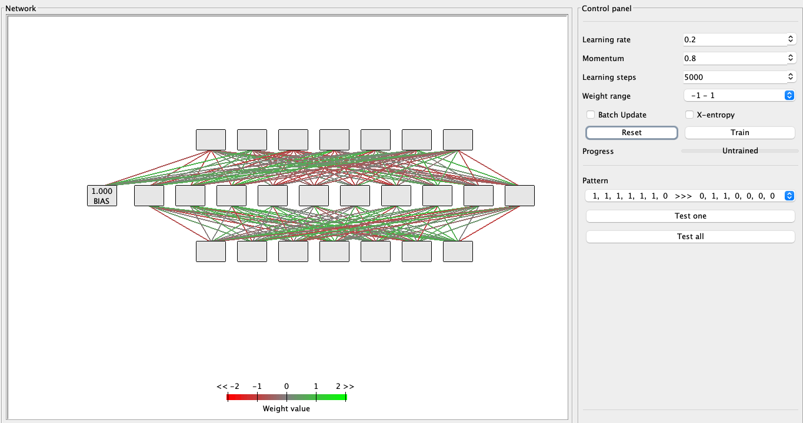
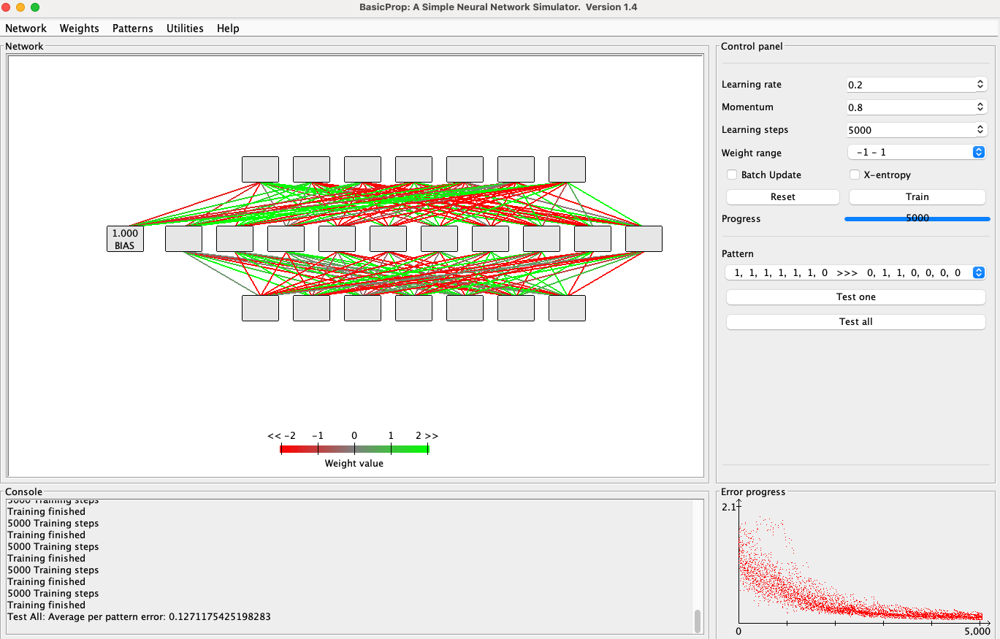
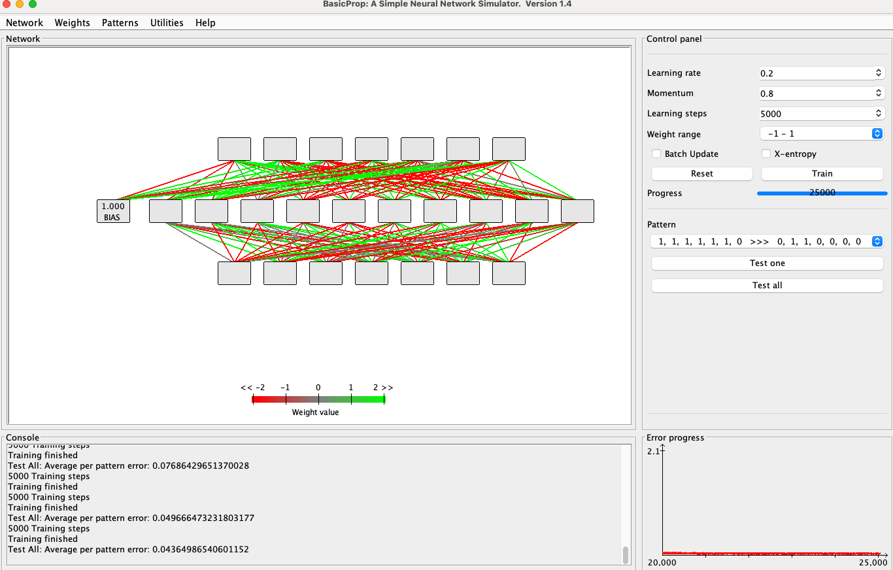
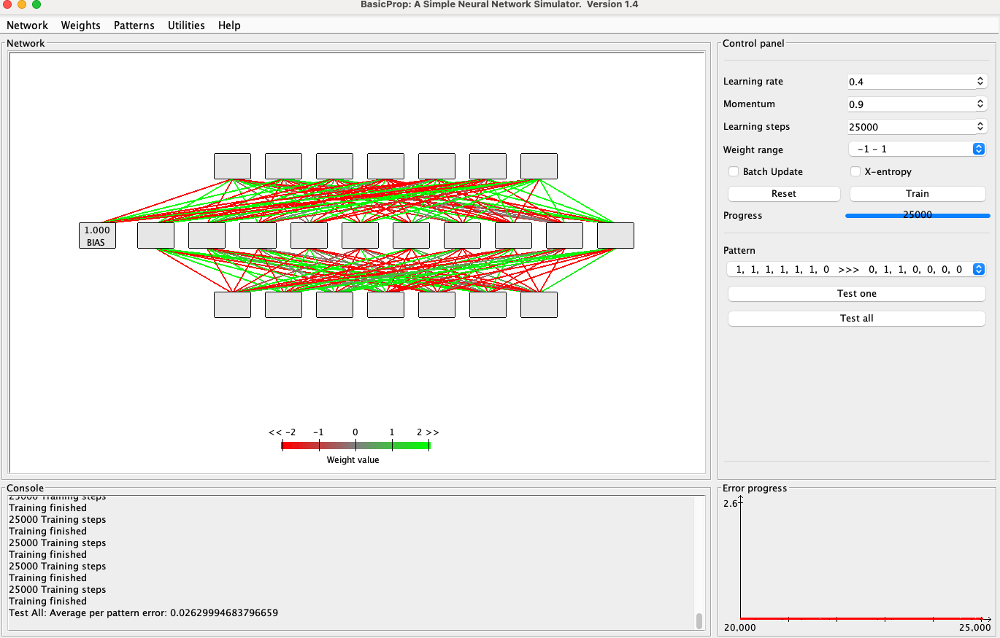

# PA

## Part 1: Write the pattern file

a. Input file
7セグメントディスプレイは、各セグメントが点灯（1）または非点灯（0）で表現され、数字や文字を構成します。以下は、それぞれのパターンの入力表現を示します。

```file
0: 1 1 1 1 1 1 0
1: 0 1 1 0 0 0 0
2: 1 1 0 1 1 0 1
3: 1 1 1 1 0 0 1
4: 0 1 1 0 0 1 1
5: 1 0 1 1 0 1 1
6: 1 0 1 1 1 1 1
7: 1 1 1 0 0 0 0
8: 1 1 1 1 1 1 1
9: 1 1 1 1 0 1 1
A: 1 1 1 0 1 1 1
b: 0 0 1 1 1 1 1
C: 1 0 0 1 1 1 0
d: 0 1 1 1 1 0 1
E: 1 0 0 1 1 1 1
F: 1 0 0 0 1 1 1
```

b. Output file
出力は、ASCIIコードに基づいてバイナリ形式に変換されます。以下は、それぞれの出力値を示します。

```file
0 (48): 0 1 1 0 0 0 0
1 (49): 0 1 1 0 0 0 1
2 (50): 0 1 1 0 0 1 0
3 (51): 0 1 1 0 0 1 1
4 (52): 0 1 1 0 1 0 0
5 (53): 0 1 1 0 1 0 1
6 (54): 0 1 1 0 1 1 0
7 (55): 0 1 1 0 1 1 1
8 (56): 0 1 1 1 0 0 0
9 (57): 0 1 1 1 0 0 1
A (65): 1 0 0 0 0 0 1
B (66): 1 0 0 0 0 1 0
C (67): 1 0 0 0 0 1 1
D (68): 1 0 0 0 1 0 0
E (69): 1 0 0 0 1 0 1
F (70): 1 0 0 0 1 1 0
H (72): 1 0 0 1 0 0 0
```

c. Pattern file
ここまでの情報をもとにトレーニングに使用するテキストファイルを作成しました。以下はその内容です。

```file
Number of patterns = 17
Number of inputs = 7
Number of outputs = 7
[patterns]
1 1 1 1 1 1 0    0 1 1 0 0 0 0  # 0
0 1 1 0 0 0 0    0 1 1 0 0 0 1  # 1
1 1 0 1 1 0 1    0 1 1 0 0 1 0  # 2
1 1 1 1 0 0 1    0 1 1 0 0 1 1  # 3
0 1 1 0 0 1 1    0 1 1 0 1 0 0  # 4
1 0 1 1 0 1 1    0 1 1 0 1 0 1  # 5
1 0 1 1 1 1 1    0 1 1 0 1 1 0  # 6
1 1 1 0 0 0 0    0 1 1 0 1 1 1  # 7
1 1 1 1 1 1 1    0 1 1 1 0 0 0  # 8
1 1 1 1 0 1 1    0 1 1 1 0 0 1  # 9
1 1 1 0 1 1 1    1 0 0 0 0 0 1  # A
0 0 1 1 1 1 1    1 0 0 0 0 1 0  # B
1 0 0 1 1 1 0    1 0 0 0 0 1 1  # C
0 1 1 1 1 0 1    1 0 0 0 1 0 0  # D
1 0 0 1 1 1 1    1 0 0 0 1 0 1  # E
1 0 0 0 1 1 1    1 0 0 0 1 1 0  # F
1 0 0 1 0 0 0    1 0 0 1 0 0 0  # H
```

## Part 2: Analysis results

作成した`pat`を利用して分析を行う。適切な分析となるようにパラメータの調整を行った結果を以下で説明する。

・ネットワーク設定
入力および出力ユニット数は固定で7です。Layer 1のユニット数については、学習結果を分析した結果、10が最適と判断しました。以下はネットワーク設定のスクリーンショットです。


FIGURE1 Network Configuration

・コントロールパネル設定
コントロールパネルで調整した主なパラメータは以下の2つです。

1. Learning rate: デフォルト0.3を0.2に変更。
2. Momentum: デフォルト0.8を採用。

FIGURE 2 Parameter
以下は、適切ではない設定のError progressの例です。

FIGURE 3 Bad pattern

**設定結果**
5000回のトレーニングではエラー率0.127で、25000回で最終的にエラー率0.04364に達しました。


FIGURE 4: Error Progress after 5000 iterations


FIGURE 5: Error Progress after 25000 iterations

**平均エラー率と結果**
各パターンの平均エラー率は以下の通りです。

Pattern: " 1,  1,  1,  1,  1,  1,  0   >>>   0,  1,  1,  0,  0,  0,  0 "
Result: " 0.02, 0.98, 0.98, 0.04, 0, 0.03, 0.02 "
Pattern: " 0,  1,  1,  0,  0,  0,  0   >>>   0,  1,  1,  0,  0,  0,  1 "
Result: " 0.01, 0.99, 0.99, 0.01, 0.02, 0.01, 0.97 "
Pattern: " 1,  1,  0,  1,  1,  0,  1   >>>   0,  1,  1,  0,  0,  1,  0 "
Result: " 0.01, 0.99, 0.99, 0.02, 0.01, 0.99, 0.01 "
Pattern: " 1,  1,  1,  1,  0,  0,  1   >>>   0,  1,  1,  0,  0,  1,  1 "
Result: " 0, 1, 1, 0.02, 0.03, 0.97, 0.98 "
Pattern: " 0,  1,  1,  0,  0,  1,  1   >>>   0,  1,  1,  0,  1,  0,  0 "
Result: " 0.02, 0.98, 0.98, 0.01, 0.97, 0, 0.03 "
Pattern: " 1,  0,  1,  1,  0,  1,  1   >>>   0,  1,  1,  0,  1,  0,  1 "
Result: " 0.01, 1, 1, 0.02, 0.99, 0.01, 0.98 "
Pattern: " 1,  0,  1,  1,  1,  1,  1   >>>   0,  1,  1,  0,  1,  1,  0 "
Result: " 0.02, 0.98, 0.98, 0, 0.99, 0.99, 0 "
Pattern: " 1,  1,  1,  0,  0,  0,  0   >>>   0,  1,  1,  0,  1,  1,  1 "
Result: " 0.01, 0.99, 0.99, 0, 0.96, 0.99, 1 "
Pattern: " 1,  1,  1,  1,  1,  1,  1   >>>   0,  1,  1,  1,  0,  0,  0 "
Result: " 0, 1, 1, 0.96, 0, 0, 0.03 "
Pattern: " 1,  1,  1,  1,  0,  1,  1   >>>   0,  1,  1,  1,  0,  0,  1 "
Result: " 0, 1, 1, 0.97, 0, 0.01, 0.97 "
Pattern: " 1,  1,  1,  0,  1,  1,  1   >>>   1,  0,  0,  0,  0,  0,  1 "
Result: " 0.98, 0.02, 0.02, 0.01, 0.03, 0.02, 0.97 "
Pattern: " 0,  0,  1,  1,  1,  1,  1   >>>   1,  0,  0,  0,  0,  1,  0 "
Result: " 0.99, 0.01, 0.01, 0, 0.02, 0.97, 0 "
Pattern: " 1,  0,  0,  1,  1,  1,  0   >>>   1,  0,  0,  0,  0,  1,  1 "
Result: " 1, 0, 0, 0, 0, 0.98, 0.98 "
Pattern: " 0,  1,  1,  1,  1,  0,  1   >>>   1,  0,  0,  0,  1,  0,  0 "
Result: " 0.98, 0.02, 0.02, 0, 0.98, 0.02, 0 "
Pattern: " 1,  0,  0,  0,  1,  1,  1   >>>   1,  0,  0,  0,  1,  1,  0 "
Result: " 1, 0, 0, 0, 0.99, 0.99, 0.03 "
Pattern: " 1,  0,  0,  0,  1,  1,  1   >>>   1,  0,  0,  0,  1,  1,  0 "
Result: " 1, 0, 0, 0, 0.99, 0.99, 0.03 "
Pattern: " 1,  0,  0,  1,  0,  0,  0   >>>   1,  0,  0,  1,  0,  0,  0 "
Result: " 0.99, 0.01, 0.01, 0.98, 0, 0.01, 0.03 "

**最適化例**
Learning rateを0.4、Momentumを0.9に設定することで、エラー率0.026299を達成しました。


FIGURE 6: Optimized parameters
